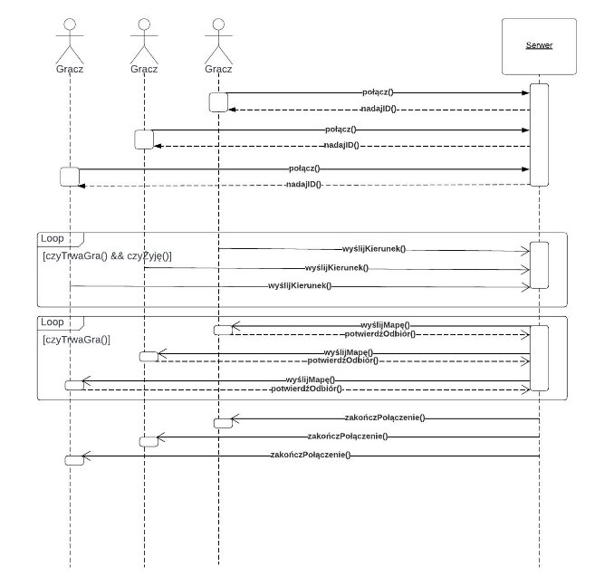

Mateusz Stencel 188676 Tomasz Szcząchor 188721 Oskar Ruczyński 188862   

**Wstęp**

Celem projektu jest zaimplementowanie prostej wieloosobowej gry konsolowej typu Slither.io. Do implementacji zostanie użyty język C++. Działanie gry będzie oparte o architekturę client-server oraz protokół komunikacyjny TCP. Do obsługi połączeń zostaną wykorzystane interfejsy dostępne w bibliotece WinAPIWinsock2.

**Rozgrywka**

W danej rozgrywce bierze udział 3 graczy. Gracz steruje kierunkiem przemieszczania się węża. Węże poruszają się po wspólnej mapie. Jedno pole na mapie może być zajmowane tylko przez jednego węża. Co pewien ustalony czas na mapie generowane są bonusy. Gdy wąż najdzie na bonus, wydłuża się o jeden człon. W czasie rozgrywki węże mogą się ze sobą zderzyć. Wąż, który uderzy głową w ciało innego węża (nie głowę) przegrywa, bez względu na jego długość. W przypadku gdy wąż wyjdzie poza krawędź mapy, pojawia się po drugiej stronie planszy. Rozgrywka kończy się gdy na planszy pozostanie jeden wąż lub jeden z węży osiągnie określoną długość postaci.

**Implementacja**

Serwer rozpoczyna rozgrywkę, gdy połączy się 3 graczy. Każdy gracz otrzymuje unikalny identyfikator. Do czasu rozpoczęcia rozgrywki, gracze znajdują się w stanie oczekiwania na grę. Pozycja startowa gracza dla danego identyfikatora jest z góry ustalona. Podczas gry klient przesyła do serwera informacje o kierunku, w którym ma podążać jego wąż. Informacja ta jest przesyłana wtedy, gdy aktualnie wciśnięty klawisz sterujący przypisany jest do innego kierunku niż kierunek poprzednio wysłany. Klient także potwierdza odebranie mapy od serwera. Serwer porusza wężami na podstawie informacji zawartych w buforze kierunków. Bufor kierunków przechowuje kierunki zebrane od każdego gracza. Serwer kilka razy na sekundę generuje nową mapę. Przesuwa wężami w jednym z kierunków: w górę, w dół, w prawo, w lewo. Obsługuje kolizje węży jeśli taka nastąpi. Wydłuża o 1 segment węże, które zdobyły bonus. Raz na kilka rund dodaje bonusy na mapie. Wysyła klientom stan mapy oraz informację o tym czy wciąż biorą udział w rozgrywce. Kolejność poruszania wężami odbywa się zgodnie z rosnącą wartością identyfikatorów nadanych im przez serwer. Klient otrzymaną mapę przetwarza, a następnie wyświetla. Gdy rozgrywka zakończy się, wszyscy gracze zostaną o tym powiadomieni. Serwer sprawdza połączenie z klientem poprzez oczekiwanie na odpowiedź odbioru wysłania mapy.

**Przewidywane problemy i propozycje ich rozwiązania**

1. Węże zderzają się głowami - zniszczony zostaje krótszy wąż, w przypadku równej długości losujemy wygranego.
2. Zebranie jedzenia w tym samym momencie - najpierw sprawdzane są kolizje węży, więc problem sprowadza się do punktu 1.
1. Nieplanowane rozłączenie gracza (odłączenie od internetu, awaria komputera itp.) wykrywane jest przez serwer - wystąpi błąd połączenia lub dany klient 3 razy pod rząd nie odpowie na wysłanie mapy.
3. W przypadku rozłączenia gracza, gracz przegrywa, a jego wąż znika z planszy.
4. Jeśli klient będzie próbował podłączyć się w trakcie gry, zostanie powiadomiony, że nie może się połączyć.
5. Przytrzymanie klawisza sterującego przez użytkownika nie spowoduje redundantnego wysyłania informacji do serwera o kierunku przemieszczania się. Informacja ta jest wysyłana tylko wtedy, gdy kierunek w ostatnio wysłanej wiadomości był różny od kierunku wyznaczonego przez aktualnie wciśnięty klawisz sterujący.

**Diagram klas**

Poniżej znajduje się diagram klas. Aplikacja kliencka jest reprezentowana przez pojedynczą klasę Klient. Znajdują się w niej wszystkie potrzebne komponenty do łączenia się z serwerem, wysyłania i odbierania danych z serwera. Obiekt klasy Gra zawiera informacje o aktualnym stanie mapy, jak i metody pozwalające ten stan zmieniać. Serwer może posiadać tylko jeden obiekt klasy Gra w danym momencie. Klasa Gracz reprezentuje podłączonego klienta, i zawiera związane z nim informacje, takie jak aktualnie wybrany przez niego kierunek, długość węża, identyfikator i położenie wszystkich części jego ciała w postaci listy Punktów na mapie.

**Diagram sekwencji**

Poniżej znajduje się diagram sekwencji. Gracze podłączają się do serwera, który nadaje im unikalny identyfikator i oczekują na rozpoczęcie gry. W momencie gdy do serwera jest podłączonych 3 graczy, serwer przestaje oczekiwać na kolejnych graczy. Wysyła informacje o rozpoczęciu rozgrywki i przechodzi w tryb nasłuchiwania ruchów graczy oraz wysyłania planszy. Podczas gry, gracz wysyła kierunek, w którym ma podążać jego postać. Serwer wysyła klientom stan gry w postaci tablicy znaków ASCII, klient taką tablicę przetwarza i wyświetla jako mapa na konsoli oraz wysyła do serwera informację o odebraniu mapy. Po zakończeniu rozgrywki serwer wysyła informację graczom o końcu gry. Następnie połączenie między serwerem i klientem zostaje zamknięte.

